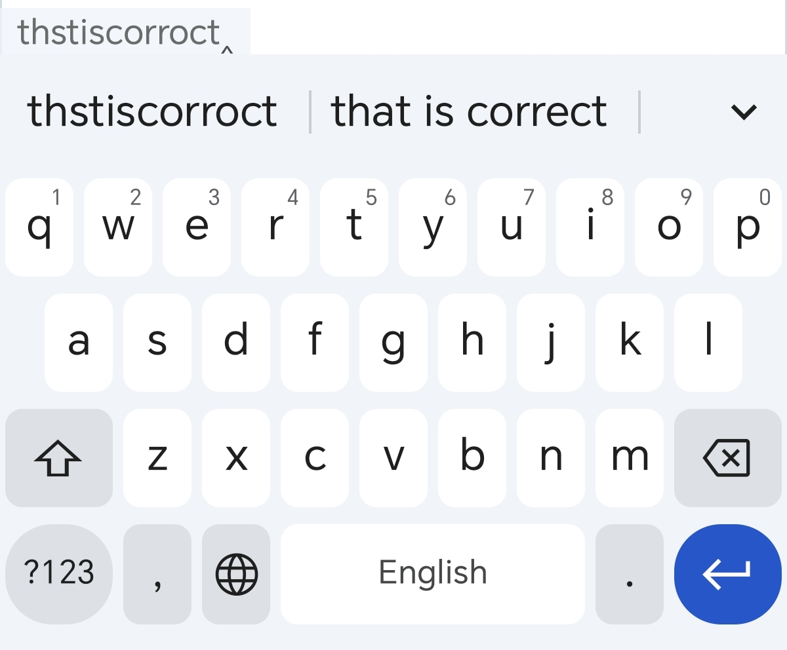

# rime-english-correct
支持纠错的英文输入方案
# 教程
下载 [英文纠错方案](https://github.com/x-skystar/rime-english-correct/releases/) 放进 Rime 个人用户文件夹里，重新部署，启用 English Correct 方案即可。特别地，对于不想被纠正的自定义单词，可以在 `lua/english/en_extra.txt` 中添加，重新部署即可。
# 效果展示

